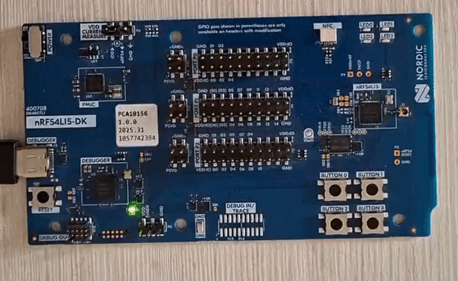
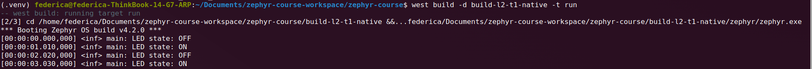
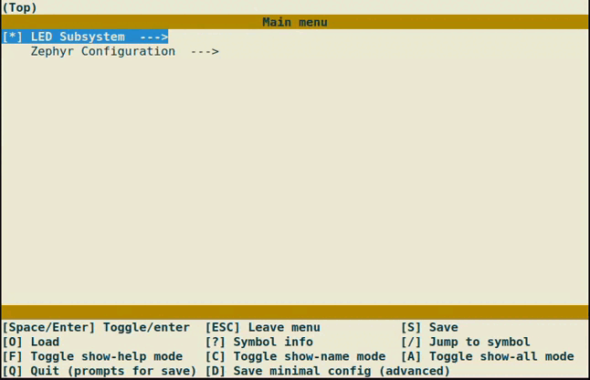
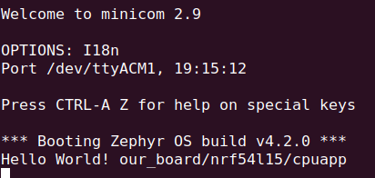
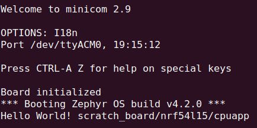
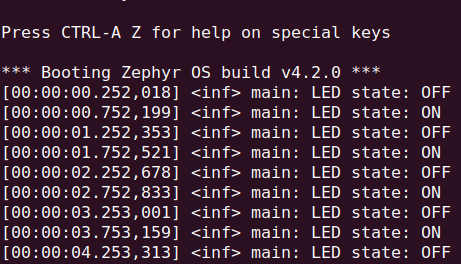
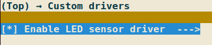

# Zephyr Training Environment

Welcome to the Zephyr RTOS training! This repository includes a ready-to-use
development environment based on Zephyr 4.3.0, which you can set up in one of
three ways:

---

## Manual Zephyr Setup

Follow the following guide:
- [Getting Started Guide](https://docs.zephyrproject.org/latest/develop/getting_started/index.html#).

Make sure to select appropriate OS and to perform all steps till
[Build the Blinky Sample](https://docs.zephyrproject.org/latest/develop/getting_started/index.html#build-the-blinky-sample).

---

# Lesson 2

## Task 1

1. Fork and set up the provided workspace.

    1. Install Zephyr SDK.
    2. Set up environment.

2. Build and run an LED blink application.

    1. Flash to your hardware board.
    2. Verify the LED toggles every second.
    3. Push tag: `l2-task1`.

3. (_Optional_) Build and run on `native_sim`.

    1. Check the boot header for the OS version.

This task demonstrates the setup of a Zephyr workspace and the successful build and execution of the Blinky sample application on both the target hardware platform and the native simulation environment.

### Workspace setup

A dedicated workspace was created and initialized using `west`. Dependencies were fetched according to the manifest configuration.

Commands used:

```bash
python3 -m venv .venv
source .venv/bin/activate
pip install west

west init -l zephyr-course
west update
west zephyr-export
```

The Zephyr SDK was automatically detected and configured for the build system.

### Checking Setup

In order to check everything was properly installed, do the following.

Open a new terminal, step into the workspace and enable the build environment:

```bash
cd zephyr-course-workspace/

source .venv/bin/activate
source ./zephyr/zephyr-env.sh
```
### Build and flash on hardware

The Blinky sample application was built and flashed to the nRF54L15 DK development board.

Command used to build:

```bash
west build -b nrf54l15dk/nrf54l05/cpuapp app/ -d build-l2-t1
```

Command used to flash:

```bash
west flash -d build-l2-t1
```

The firmware was successfully programmed into the board, and the LED toggled as expected, confirming correct execution on the physical device.

#### Evidence


### Build and execution on native simulation

The same application was built for the native simulation target and executed locally.

Command used to build:

```bash
west build -b native_sim app/ -d build-l2-t1-native
```

Command used to run:

```bash
west build -d build-l2-t1-native -t run
```

Console output confirmed the expected LED toggle behavior in the simulated environment.

#### Evidence



### Result

This task validates the complete Zephyr development workflow, including:

* Workspace initialization and dependency management
* Toolchain and SDK configuration
* Firmware build process
* Flashing to target hardware
* Execution in native simulation

---

# Lesson 3

## Task 1

1. Reproduce a custom Kconfig menu for an LED subsystem.

    1. Create a top-level `menuconfig` option.
    2. Add a `choice` for blink sleep timing (250ms, 500ms, 1s, 2s) with hidden int symbol.
    3. Include a `menuconfig` for advanced and a `menu` for expert configuration sections.
    4. Integrate the configuration into Zephyr’s Kconfig system.

2. Build the application and verify configuration via `menuconfig`.

    1. Open the configuration interface.
    2. Navigate through the custom menu.
    3. Modify parameters and save configuration.
    4. Push tag: `l3-task1`.

This task demonstrates how to extend Zephyr’s configuration system by defining a custom Kconfig structure and integrating it into the global configuration tree.

### Kconfig Implementation

A custom `Kconfig` file was added to the application in order to define a configurable LED subsystem.

Key features implemented:

- A top-level `menuconfig` (`LED_SUBSYSTEM`)
- A `choice` for selecting blink intervals (250ms, 500ms, 1s, 2s)
- A hidden integer symbol (`LED_BLINKING_PERIOD`) derived from the selected option
- An `Advanced LED settings` submenu
- An `Expert settings` menu with conditional visibility (`visible if`)
- Use of `range` to constrain valid values

Additionally, the application Kconfig includes Zephyr’s base configuration:

```bash
source "Kconfig.zephyr"
```

This ensures that all standard Zephyr symbols (e.g., GPIO, LOG) remain available.

### Build and Configuration

The application was built using the following command:

```bash
west build -b nrf54l15dk/nrf54l15/cpuapp app/ -p -d build-l3-t1
```

To access the configuration interface:

```bash
west build -t menuconfig -d build-l3-t1
```

#### Evidence


### Result

This task validates:

* Integration of a custom Kconfig into Zephyr
* Use of menus, choices, and conditional visibility
* Parameter validation with ranges
* Interaction with Zephyr’s menuconfig system

The LED subsystem is now fully configurable at build time through a structured and user-friendly interface.

---

# Lesson 4

## Task 1

1. Create a Devicetree overlay for the application LED.

    1. Add an `app.overlay` file.
    2. Create an alias `app-led` pointing to the board `led0`.
    3. Use `DT_ALIAS(app_led)` in the application.

2. Add a configurable heartbeat period using Kconfig.

    1. Define `APP_HEARTBEAT_PERIOD_MS`.
    2. Set default value to 500.
    3. Limit valid range to 100-2000.
    4. Use the symbol as the LED blink delay.

3. Build and verify configuration via `menuconfig`.

    1. Open the configuration interface.
    2. Modify the heartbeat period.
    3. Rebuild and flash the firmware.
    4. Verify LED blink speed changes accordingly.
    5. Push tag: `l4-task1`.

This task demonstrates the integration between Zephyr Devicetree and Kconfig systems by combining hardware abstraction with configurable application behavior.

### Devicetree Overlay

An `app.overlay` file was added to define an application-specific LED alias:

```
/ {
    aliases {
        app-led = &led0;
    };
};
```

The application accesses the LED using:

```C++
#define LED_NODE DT_ALIAS(app_led)
```

### Kconfig Integration

A configurable heartbeat period was added through the application Kconfig file:

```
config APP_HEARTBEAT_PERIOD_MS
    int "Heartbeat period in milliseconds"
    range 100 2000
    default 500
```

The configuration symbol is used directly in the application:

```C++
k_msleep(CONFIG_APP_HEARTBEAT_PERIOD_MS);
```

### Build and Configuration

The application was built using:

```bash
west build -b nrf54l15dk/nrf54l15/cpuapp app/ -p -d build-l4-t1
```

To flash the firmware:

```bash
west flash -d build-l4-t1
```

To open the configuration interface:

```bash
west build -d build-l4-t1 -t menuconfig
```

#### Evidence


### Result

This task validates:

- Usage of Devicetree overlays in Zephyr
- Creation of custom Devicetree aliases
- Use of configurable Kconfig symbols
- Integration between Devicetree, Kconfig, and application code

---

# Lesson 5

## Task 1

1. Create a custom board using the copy/rename method.

    1. Copy the contents of `deps/zephyr/boards/nordic/nrf54l15dk`.
    2. Rename the board directory and files to `our_board`.
    3. Update board identifiers, Devicetree compatibles, and Kconfig symbols.

2. Build the `hello_world` sample for the custom board.

    1. Point Zephyr to the out-of-tree board with `BOARD_ROOT`.
    2. Build for `our_board/nrf54l15/cpuapp`.
    3. Flash to the nRF54L15 DK and verify serial output.

3. Place the board directory in `<project_root>/boards/`.

4. Push tag: `l5-task1`.

This task demonstrates how to create an out-of-tree board definition by adapting an existing in-tree board and how to build a Zephyr sample against it.

### Custom Board Implementation

The nRF54L15 DK board was used as the reference and copied into `app/boards/our_board/`.

Key changes applied during the copy/rename process:

- Board directory renamed to `our_board`
- Board metadata updated in `board.yml` (`name: our_board`, `vendor: zephyr-course`)
- Variant files renamed to the `our_board_<soc>_<cluster>` pattern (`.yaml`, `.dts`, `_defconfig`)
- YAML `identifier` fields updated.
- Devicetree `compatible` strings updated.
- Shared `.dtsi` files renamed to `our_board_common.dtsi` and `our_board_nrf54l_05_10_15-pinctrl.dtsi`
- Kconfig symbols updated to `BOARD_OUR_BOARD_*` in `Kconfig.our_board`, `Kconfig`, and `Kconfig.defconfig`

Since the board lives outside the Zephyr tree, the build system must be told where to find it. The path must point to the directory that **contains** the `boards/` folder (in this case `app/`).

```bash
-DBOARD_ROOT=$PWD/app
```

### Build and Flash

Build the `hello_world` sample for the custom board (run from the `zephyr-course/` directory):

```bash
west build -b our_board/nrf54l15/cpuapp ../deps/zephyr/samples/hello_world -p -d build-l5-t1 -DBOARD_ROOT=$PWD/app
```

To flash the firmware:

```bash
west flash -d build-l5-t1
```

#### Evidence

Open a serial terminal on the board UART at 115200 baud (nRF Connect Serial Terminal, `minicom`, or `screen`). The expected output is:



### Result

This task validates:

- Creation of an out-of-tree board using the copy/rename method
- Correct renaming of board files, identifiers, and Kconfig symbols
- Registration of a custom board through `BOARD_ROOT`
- Successful build of the `hello_world` sample for the custom board target

## Task 2

1. Create a custom board using the from-scratch method.

    1. Define the minimum board metadata in `board.yml`.
    2. Select the SoC in `Kconfig.scratch_board`.
    3. Describe only the required hardware in `scratch_board_nrf54l15_cpuapp.dts`.

2. Build the `hello_world` sample for said custom board.

    1. Build for `scratch_board/nrf54l15/cpuapp`.
    2. Flash to the nRF54L15 DK and verify serial output.

3. Add a board init hook that prints `Board initialized` before application `main()`.

4. Push tag: `l5-task2`.

This task demonstrates how to define a complete but minimal out-of-tree board manually, without copying an existing in-tree board definition.

### Custom Board Implementation

A second board named `scratch_board` was created in `app/boards/scratch_board/` using only the files required for the nRF54L15 application core:

```bash
app/boards/scratch_board/
├── board.yml
├── Kconfig.scratch_board
├── scratch_board_nrf54l15_cpuapp.dts
├── scratch_board_nrf54l15_cpuapp.yaml
├── scratch_board_nrf54l15_cpuapp_defconfig
├── board.cmake
├── board.c
└── CMakeLists.txt
```

`board.yml` declares the board name, vendor, and target SoC:

```yaml
board:
  name: scratch_board
  full_name: Scratch Board
  vendor: zephyr-course
  socs:
    - name: nrf54l15
```

`Kconfig.scratch_board` links the board to the correct SoC:

```kconfig
config BOARD_SCRATCH_BOARD
	select SOC_NRF54L15_CPUAPP
```

The early board message is implemented in `board.c` with a `SYS_INIT()` hook that runs before application `main()`:

```c
static int scratch_board_init(void)
{
	printk("Board initialized\n");
	return 0;
}

SYS_INIT(scratch_board_init, POST_KERNEL, CONFIG_KERNEL_INIT_PRIORITY_DEFAULT);
```

### Build and Flash

Build the `hello_world` sample for the from-scratch board (run from the `zephyr-course/` directory):

```bash
west build -b scratch_board/nrf54l15/cpuapp ../deps/zephyr/samples/hello_world -p -d build-l5-t2 -DBOARD_ROOT=$PWD/app
```

To flash the firmware:

```bash
west flash -d build-l5-t2
```

Open a serial terminal on the board UART at 115200 baud. The expected output is:

```
Board initialized
*** Booting Zephyr OS build ...
Hello World! scratch_board/nrf54l15/cpuapp
```

The custom application in `app/` can also be built against the same board to keep the LED heartbeat behavior:

```bash
west build -b scratch_board/nrf54l15/cpuapp app/ -p -d build-l5-t2-app -DBOARD_ROOT=$PWD/app
```

#### Evidence


### Result

This task validates:

- Creation of a minimal out-of-tree board from scratch
- Manual definition of `board.yml`, Kconfig, and Devicetree files
- Board-level initialization before application entry point
- Successful build of the `hello_world` sample for the custom board target

---

# Lesson 6

## Task 1

1. Create a sensor driver following the driver structure from the lecture.

2. Implement `sensor_sample_fetch` and `sensor_channel_get` for an on-board LED.

    1. `sensor_sample_fetch` turns the LED on; `sensor_channel_get` turns it off.
    3. Add Devicetree binding, overlay node, Kconfig, and CMake integration.
    4. Update the application to use the sensor API instead of direct GPIO calls.

3. Build, flash, and verify LED blink and serial logs.

4. Push tag: `l6-task1`.

This task demonstrates how to implement an out-of-tree Zephyr sensor driver and integrate it with Devicetree, Kconfig, and application code.

### Driver Implementation

An out-of-tree sensor driver was added under `app/drivers/subsys/led_sensor/`.

The driver registers with the Zephyr sensor subsystem using `DEVICE_API(sensor, ...)` and `SENSOR_DEVICE_DT_INST_DEFINE`. The public API is the standard sensor interface from `<zephyr/drivers/sensor.h>`:

- `sensor_sample_fetch` drives the LED GPIO high
- `sensor_channel_get` drives the LED GPIO low and returns the last sampled value on `SENSOR_CHAN_PROX`

Directory layout:

```bash
app/
├── drivers/subsys/led_sensor/
│   ├── led_sensor.c
│   ├── CMakeLists.txt
│   └── Kconfig
├── dts/bindings/sensor/zephyr-course,led-sensor.yaml
├── dts/bindings/vendor-prefixes.txt
└── app.overlay
```

### Kconfig Integration

The driver is enabled through a `menuconfig` option sourced from the application Kconfig under **Custom drivers**:

```
menuconfig LED_SENSOR
    bool "Enable LED sensor driver"
    depends on DT_HAS_ZEPHYR_COURSE_LED_SENSOR_ENABLED
    select GPIO
    select SENSOR
```

`prj.conf` enables the driver and the sensor subsystem:

```
CONFIG_SENSOR=y
CONFIG_LED_SENSOR=y
```

CMake only compiles the driver when `CONFIG_LED_SENSOR` is set, and `BOARD_ROOT` must point to the directory that contains `boards/` (that is, `app/`).

### Devicetree Overlay

The overlay defines the sensor node and a `led-sensor` alias (same GPIO as board `led0`):

```
/ {
    aliases {
        led-sensor = &led_sensor;
    };

    led_sensor: led-sensor {
        compatible = "zephyr-course,led-sensor";
        gpios = <&gpio2 9 GPIO_ACTIVE_HIGH>;
        status = "okay";
    };
};

&led0 {
    status = "disabled";
};
```

The application obtains the device with:

```C++
#define LED_SENSOR_NODE DT_ALIAS(led_sensor)
static const struct device *const led_sensor = DEVICE_DT_GET(LED_SENSOR_NODE);
```

GPIO setup and toggle calls were replaced by `device_is_ready`, `sensor_sample_fetch_chan`, and `sensor_channel_get`, keeping the original loop structure and log format:

```C++
while (1) {
    sensor_sample_fetch_chan(led_sensor, SENSOR_CHAN_ALL);
    k_msleep(CONFIG_APP_HEARTBEAT_PERIOD_MS / 2);

    sensor_channel_get(led_sensor, SENSOR_CHAN_PROX, &val);
    led_state = !led_state;
    LOG_INF("LED state: %s", led_state ? "ON" : "OFF");

    k_msleep(CONFIG_APP_HEARTBEAT_PERIOD_MS / 2);
}
```

Each cycle splits `APP_HEARTBEAT_PERIOD_MS` in half: the LED is on between fetch and get, then off until the next fetch (similar duty cycle to the original GPIO toggle).

The board `led0` node is disabled in a separate overlay fragment (`&led0 { status = "disabled"; };`) because it shares the same GPIO with `led-sensor`; otherwise the `gpio-leds` driver would conflict with our sensor driver.

### Build and Flash

Build the application for the custom board (run from the `zephyr-course/` directory):

```bash
west build -b our_board/nrf54l15/cpuapp app/ -p -d build-l6-t1 -DBOARD_ROOT=$PWD/app
```

To flash the firmware:

```bash
west flash -d build-l6-t1
```

#### Evidence

The on-board LED0 should blink (on after fetch, off after get; full blink period = `APP_HEARTBEAT_PERIOD_MS`, default 500 ms).


Open a serial terminal on the board UART at 115200 baud (`minicom`).
```bash
minicom -D /dev/ttyACM1
```

The expected output alternates:

```
[00:00:00.250,000] <inf> main: LED state: ON
[00:00:00.500,000] <inf> main: LED state: OFF
```



The on-board LED should blink at half the heartbeat period on and half off (full period = `APP_HEARTBEAT_PERIOD_MS`). Serial logs alternate `LED state: ON` / `OFF` each cycle.

To open the configuration interface:

```bash
west build -d build-l6-t1 -t menuconfig
```

Navigate to **Custom drivers** and confirm `CONFIG_LED_SENSOR` is enabled.



### Result

This task validates:

- Implementation of an out-of-tree sensor driver with `sample_fetch` and `channel_get`
- Devicetree binding and overlay integration for a custom compatible
- Kconfig and CMake wiring to enable and build the driver
- Application use of the Zephyr sensor API instead of direct GPIO access
- Visible LED blink driven by fetch/get timing without GPIO pin conflicts
